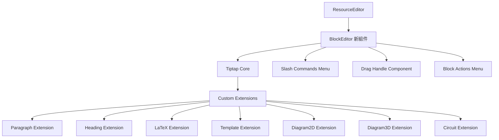
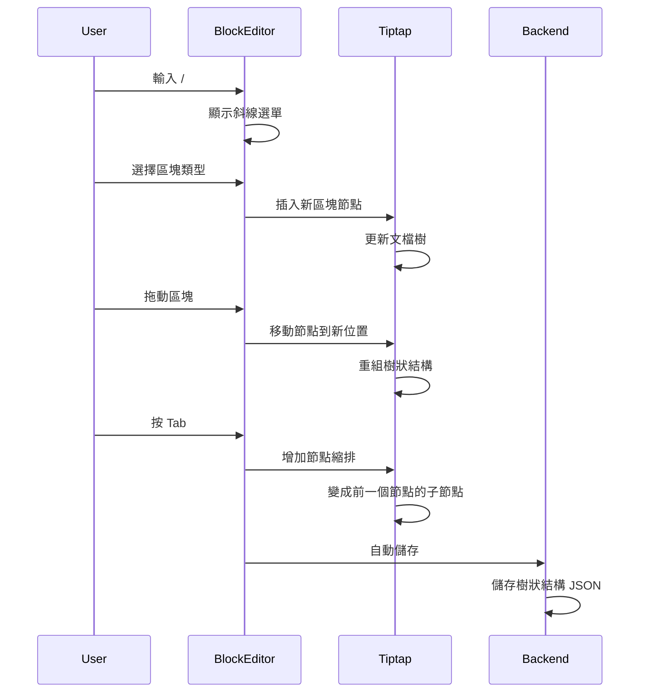

# Notion-like 樹狀編輯器重構計劃

## 🎉 專案完成總結

**完成日期**: 2025-12-18

### 已實作功能

✅ **核心功能**

- Tiptap 基礎編輯器設置與配置
- 樹狀區塊結構支援(無限嵌套)
- 斜線命令系統(/命令選單)
- 拖動與重新排序功能
- 鍵盤快捷鍵系統

✅ **自訂區塊類型**

- LaTeX 數學公式區塊
- 模板引用區塊
- 2D 圖形區塊(JSXGraph)
- 3D 圖形區塊(Three.js)
- 電路圖區塊
- 題目引用區塊
- 分頁符區塊

✅ **整合完成**

- ResourceEditor 支援新舊編輯器切換
- TemplateEditor 完全使用新編輯器
- 資料格式轉換器(舊格式 ↔ Tiptap 格式)

### 檔案結構

```javascript
frontend/src/components/BlockEditor/
├── BlockEditor.vue                 # 主編輯器組件
├── components/                     # Vue 區塊組件
│   ├── LaTeXBlockComponent.vue
│   ├── TemplateBlockComponent.vue
│   ├── Diagram2DBlockComponent.vue
│   ├── Diagram3DBlockComponent.vue
│   ├── CircuitBlockComponent.vue
│   ├── QuestionBlockComponent.vue
│   ├── PageBreakBlockComponent.vue
│   ├── SlashMenu.vue              # 斜線命令選單
│   └── DragHandle.vue             # 拖動手柄
├── extensions/                     # Tiptap Extensions
│   ├── LaTeXBlock.js
│   ├── TemplateBlock.js
│   ├── Diagram2DBlock.js
│   ├── Diagram3DBlock.js
│   ├── CircuitBlock.js
│   ├── QuestionBlock.js
│   ├── PageBreakBlock.js
│   ├── SlashCommands.js           # 斜線命令系統
│   ├── KeyboardShortcuts.js       # 鍵盤快捷鍵
│   ├── DragHandle.js              # 拖動功能
│   ├── Nesting.js                 # 嵌套功能
│   └── index.js                   # Extensions 匯出
└── utils/
    ├── commandItems.js            # 命令項目配置
    └── structureConverter.js     # 資料格式轉換
```


### 保留的舊組件

以下組件仍在其他地方使用,已保留:

- `RichTextEditor.vue` - 用於 QuestionForm 和 StudentErrorLog
- `RichTextPreview.vue` - 用於 Runner 和 List 組件
- `DraggablePreview.vue` - RichTextEditor 的預覽模式
- `MarkdownEditor.vue` - RichTextEditor 的編輯模式
- `markdownBlockParser.js` - DraggablePreview 使用的解析器

### 使用指南

#### 基本操作

- **新增區塊**: 輸入 `/` 顯示命令選單
- **拖動區塊**: Hover 區塊顯示拖動手柄,拖動重新排序
- **縮排/取消縮排**: Tab / Shift+Tab(列表項)
- **移動區塊**: Cmd/Ctrl + Shift + ↑/↓
- **複製區塊**: Cmd/Ctrl + D
- **刪除區塊**: Cmd/Ctrl + Shift + D

#### 在 ResourceEditor 中使用

```vue
<BlockEditor
  :model-value="tiptapStructure"
  @update:model-value="handleBlockEditorUpdate"
  :templates="templates"
  :questions="questions"
/>
```


#### 資料格式轉換

```javascript
import { legacyToTiptapStructure, tiptapToLegacyStructure } from '@/components/BlockEditor/utils/structureConverter'

// 舊格式轉新格式
const tiptapFormat = legacyToTiptapStructure(oldStructure)

// 新格式轉舊格式(用於儲存)
const legacyFormat = tiptapToLegacyStructure(tiptapFormat)
```


### 相關文檔

- `BLOCK_EDITOR_IMPLEMENTATION_STATUS.md` - 實作狀態記錄
- `BLOCK_EDITOR_COMPLETE.md` - 完成報告
- `BLOCK_EDITOR_FINAL_STATUS.md` - 最終狀態
- `EDITOR_PREVIEW_IMPLEMENTATION.md` - 預覽功能實作
- `NOTION_EDITOR_IMPLEMENTATION.md` - Notion 風格編輯器說明

---

## 背景分析

### 現有架構問題

目前的實作：

- [`frontend/src/views/ResourceEditor.vue`](frontend/src/views/ResourceEditor.vue) - 使用線性 `structure` 陣列
- [`frontend/src/components/RichTextEditor.vue`](frontend/src/components/RichTextEditor.vue) - 只處理純文字 Markdown
- 不同類型的區塊（text, question, template）在 ResourceEditor 層級管理
- 無法在文字內部嵌套其他類型的區塊

### 目標架構

Notion-style 的樹狀編輯器：

- 統一的區塊樹狀結構
- 任何區塊都可以有子區塊（無限嵌套）
- 拖動支援調整層級關係
- 斜線命令快速插入區塊
- 完整的鍵盤快捷鍵支援

## 架構設計

### 資料結構對比

**現有結構**（線性陣列）：

```javascript
structure = [
  { id: 1, type: 'text', content: 'markdown...' },
  { id: 2, type: 'question', question_id: 123 },
  { id: 3, type: 'template', template_id: 456 }
]
```

**新結構**（樹狀）：

```javascript
structure = {
  type: 'doc',
  content: [
    {
      id: 'block-1',
      type: 'paragraph',
      attrs: {},
      content: [{ type: 'text', text: '段落內容' }],
      children: [
        {
          id: 'block-1-1',
          type: 'latex',
          attrs: { formula: 'E=mc^2' },
          children: []
        }
      ]
    },
    {
      id: 'block-2',
      type: 'template',
      attrs: { templateId: 456 },
      children: [
        {
          id: 'block-2-1',
          type: 'diagram2d',
          attrs: { config: {...} },
          children: []
        }
      ]
    }
  ]
}
```


### 架構圖




### 資料流程




## 實作階段

### 階段一：Tiptap 基礎設置與自訂區塊

**新增檔案**：

1. `frontend/src/components/BlockEditor/BlockEditor.vue` - 主編輯器組件
2. `frontend/src/components/BlockEditor/extensions/index.js` - Extension 匯出
3. `frontend/src/components/BlockEditor/extensions/BlockNode.js` - 基礎區塊節點
4. `frontend/src/components/BlockEditor/extensions/ParagraphBlock.js` - 段落區塊
5. `frontend/src/components/BlockEditor/extensions/HeadingBlock.js` - 標題區塊
6. `frontend/src/components/BlockEditor/extensions/LaTeXBlock.js` - LaTeX 區塊
7. `frontend/src/components/BlockEditor/extensions/TemplateBlock.js` - 模板區塊
8. `frontend/src/components/BlockEditor/extensions/Diagram2DBlock.js` - 2D 圖形區塊
9. `frontend/src/components/BlockEditor/extensions/Diagram3DBlock.js` - 3D 圖形區塊
10. `frontend/src/components/BlockEditor/extensions/CircuitBlock.js` - 電路圖區塊

**核心 Extension 結構**：

```javascript
// BlockNode.js - 所有區塊的基類
import { Node } from '@tiptap/core'

export const BlockNode = Node.create({
  name: 'blockNode',
  group: 'block',
  content: 'block*', // 可以包含其他區塊（嵌套）
  
  addAttributes() {
    return {
      id: { default: null },
      level: { default: 0 }, // 嵌套層級
    }
  },
  
  parseHTML() {
    return [{ tag: 'div[data-block]' }]
  },
  
  renderHTML({ node, HTMLAttributes }) {
    return ['div', {
      'data-block': '',
      'data-block-id': node.attrs.id,
      'data-level': node.attrs.level,
      ...HTMLAttributes
    }, 0]
  },
  
  addNodeView() {
    return VueNodeViewRenderer(BlockNodeComponent)
  }
})
```

**LaTeX Extension 範例**：

```javascript
// LaTeXBlock.js
import { Node } from '@tiptap/core'
import { VueNodeViewRenderer } from '@tiptap/vue-3'
import LaTeXBlockComponent from '../components/LaTeXBlockComponent.vue'

export const LaTeXBlock = Node.create({
  name: 'latexBlock',
  group: 'block',
  content: 'block*',
  
  addAttributes() {
    return {
      id: { default: null },
      formula: { default: '' },
      displayMode: { default: true },
    }
  },
  
  addNodeView() {
    return VueNodeViewRenderer(LaTeXBlockComponent)
  },
  
  addCommands() {
    return {
      insertLatexBlock: (attrs) => ({ commands }) => {
        return commands.insertContent({
          type: this.name,
          attrs: {
            id: `block-${Date.now()}`,
            ...attrs
          }
        })
      }
    }
  }
})
```


### 階段二：拖動與嵌套功能

**新增檔案**：

1. `frontend/src/components/BlockEditor/components/DragHandle.vue` - 拖動手柄
2. `frontend/src/components/BlockEditor/composables/useDragAndDrop.js` - 拖動邏輯
3. `frontend/src/components/BlockEditor/utils/treeOperations.js` - 樹操作工具

**拖動邏輯**：

```javascript
// useDragAndDrop.js
export function useDragAndDrop(editor) {
  const draggingNode = ref(null)
  const dropPosition = ref(null) // 'before' | 'after' | 'inside'
  
  const handleDragStart = (node) => {
    draggingNode.value = node
  }
  
  const handleDragOver = (event, targetNode) => {
    const rect = event.target.getBoundingClientRect()
    const y = event.clientY - rect.top
    const height = rect.height
    
    // 判斷插入位置
    if (y < height * 0.25) {
      dropPosition.value = 'before'
    } else if (y > height * 0.75) {
      dropPosition.value = 'after'
    } else {
      dropPosition.value = 'inside'
    }
  }
  
  const handleDrop = (targetNode) => {
    const { state, view } = editor
    const transaction = state.tr
    
    // 找到源節點和目標節點的位置
    const sourcePos = findNodePos(draggingNode.value.id)
    const targetPos = findNodePos(targetNode.id)
    
    if (dropPosition.value === 'inside') {
      // 移動為子節點
      transaction.setNodeMarkup(sourcePos, null, {
        ...draggingNode.value.attrs,
        level: targetNode.attrs.level + 1
      })
      // 移動到目標節點的 children
      moveNodeIntoParent(transaction, sourcePos, targetPos)
    } else if (dropPosition.value === 'before') {
      // 插入到前面（同層）
      moveNodeBefore(transaction, sourcePos, targetPos)
    } else {
      // 插入到後面（同層）
      moveNodeAfter(transaction, sourcePos, targetPos)
    }
    
    view.dispatch(transaction)
    draggingNode.value = null
  }
  
  return {
    handleDragStart,
    handleDragOver,
    handleDrop,
    dropPosition
  }
}
```

**視覺反饋**：

```vue
<!-- DragHandle.vue -->
<template>
  <div 
    class="drag-handle"
    draggable="true"
    @dragstart="handleDragStart"
  >
    <svg><!-- grip icon --></svg>
  </div>
  
  <!-- 插入指示線 -->
  <div 
    v-if="dropPosition === 'before'"
    class="insert-indicator insert-before"
  />
  <div 
    v-if="dropPosition === 'after'"
    class="insert-indicator insert-after"
  />
  <div 
    v-if="dropPosition === 'inside'"
    class="insert-indicator insert-inside"
  />
</template>
```


### 階段三：斜線命令系統

**新增檔案**：

1. `frontend/src/components/BlockEditor/extensions/SlashCommands.js` - 斜線命令 Extension
2. `frontend/src/components/BlockEditor/components/SlashMenu.vue` - 斜線選單 UI
3. `frontend/src/components/BlockEditor/utils/commandItems.js` - 命令項目配置

**斜線命令配置**：

```javascript
// commandItems.js
export const commandItems = [
  {
    title: '文字',
    icon: '📝',
    command: ({ editor, range }) => {
      editor.chain().focus().deleteRange(range).insertParagraph().run()
    },
    keywords: ['text', 'paragraph', '文字', '段落']
  },
  {
    title: 'LaTeX 公式',
    icon: '∑',
    command: ({ editor, range }) => {
      editor.chain().focus().deleteRange(range).insertLatexBlock().run()
    },
    keywords: ['latex', 'math', '公式', '數學']
  },
  {
    title: '模板',
    icon: '📄',
    command: ({ editor, range }) => {
      editor.chain().focus().deleteRange(range).insertTemplateBlock().run()
    },
    keywords: ['template', '模板']
  },
  {
    title: '2D 圖形',
    icon: '📊',
    command: ({ editor, range }) => {
      editor.chain().focus().deleteRange(range).insertDiagram2DBlock().run()
    },
    keywords: ['diagram', '2d', '圖形', '圖表']
  },
  {
    title: '3D 圖形',
    icon: '🎲',
    command: ({ editor, range }) => {
      editor.chain().focus().deleteRange(range).insertDiagram3DBlock().run()
    },
    keywords: ['diagram', '3d', '立體']
  },
  {
    title: '電路圖',
    icon: '⚡',
    command: ({ editor, range }) => {
      editor.chain().focus().deleteRange(range).insertCircuitBlock().run()
    },
    keywords: ['circuit', '電路', 'electronics']
  },
  {
    title: '標題 1',
    icon: 'H1',
    command: ({ editor, range }) => {
      editor.chain().focus().deleteRange(range).setHeading({ level: 1 }).run()
    },
    keywords: ['h1', 'heading', '標題']
  },
  {
    title: '標題 2',
    icon: 'H2',
    command: ({ editor, range }) => {
      editor.chain().focus().deleteRange(range).setHeading({ level: 2 }).run()
    },
    keywords: ['h2', 'heading', '標題']
  }
]
```

**Extension 實作**：

```javascript
// SlashCommands.js
import { Extension } from '@tiptap/core'
import Suggestion from '@tiptap/suggestion'

export const SlashCommands = Extension.create({
  name: 'slashCommands',
  
  addOptions() {
    return {
      suggestion: {
        char: '/',
        startOfLine: false,
        command: ({ editor, range, props }) => {
          props.command({ editor, range })
        }
      }
    }
  },
  
  addProseMirrorPlugins() {
    return [
      Suggestion({
        editor: this.editor,
        ...this.options.suggestion
      })
    ]
  }
})
```


### 階段四：鍵盤快捷鍵

**新增檔案**：

1. `frontend/src/components/BlockEditor/extensions/KeyboardShortcuts.js` - 快捷鍵 Extension

**快捷鍵實作**：

```javascript
// KeyboardShortcuts.js
import { Extension } from '@tiptap/core'

export const KeyboardShortcuts = Extension.create({
  name: 'keyboardShortcuts',
  
  addKeyboardShortcuts() {
    return {
      // Enter: 在下方新增同類型區塊
      'Enter': () => {
        const { state } = this.editor
        const { $from } = state.selection
        const node = $from.node()
        
        // 如果是空區塊，轉換為段落
        if (node.textContent.length === 0 && node.type.name !== 'paragraph') {
          return this.editor.commands.setParagraph()
        }
        
        // 否則新增同類型區塊
        return this.editor.commands.splitBlock()
      },
      
      // Backspace: 刪除空區塊或合併
      'Backspace': () => {
        const { state } = this.editor
        const { $from } = state.selection
        const node = $from.node()
        
        // 如果是空區塊且在行首，刪除區塊
        if (node.textContent.length === 0 && $from.parentOffset === 0) {
          return this.editor.commands.deleteNode(node.type.name)
        }
        
        return false // 讓預設行為處理
      },
      
      // Tab: 增加縮排（變成子區塊）
      'Tab': () => {
        return this.editor.commands.indent()
      },
      
      // Shift+Tab: 減少縮排（提升層級）
      'Shift-Tab': () => {
        return this.editor.commands.outdent()
      },
      
      // Cmd+Shift+↑: 上移區塊
      'Mod-Shift-ArrowUp': () => {
        return this.editor.commands.moveBlockUp()
      },
      
      // Cmd+Shift+↓: 下移區塊
      'Mod-Shift-ArrowDown': () => {
        return this.editor.commands.moveBlockDown()
      },
      
      // Cmd+D: 複製區塊
      'Mod-d': () => {
        return this.editor.commands.duplicateBlock()
      },
      
      // Cmd+Shift+D: 刪除區塊
      'Mod-Shift-d': () => {
        const { state } = this.editor
        const { $from } = state.selection
        const node = $from.node()
        return this.editor.commands.deleteNode(node.type.name)
      }
    }
  },
  
  addCommands() {
    return {
      indent: () => ({ state, dispatch }) => {
        // 實作縮排邏輯
        const { $from } = state.selection
        const node = $from.node()
        const prevNode = getPreviousSibling(node)
        
        if (prevNode) {
          // 移動為前一個節點的子節點
          return moveNodeIntoParent(state, dispatch, node, prevNode)
        }
        return false
      },
      
      outdent: () => ({ state, dispatch }) => {
        // 實作減少縮排邏輯
        const { $from } = state.selection
        const node = $from.node()
        const parent = $from.node(-1)
        
        if (parent && parent.type.name !== 'doc') {
          // 提升為父節點的兄弟節點
          return moveNodeOutOfParent(state, dispatch, node)
        }
        return false
      },
      
      moveBlockUp: () => ({ state, dispatch }) => {
        // 與上一個兄弟節點交換位置
        const { $from } = state.selection
        const node = $from.node()
        return swapWithPrevious(state, dispatch, node)
      },
      
      moveBlockDown: () => ({ state, dispatch }) => {
        // 與下一個兄弟節點交換位置
        const { $from } = state.selection
        const node = $from.node()
        return swapWithNext(state, dispatch, node)
      }
    }
  }
})
```


### 階段五：整合到 ResourceEditor

**修改檔案**：

1. [`frontend/src/views/ResourceEditor.vue`](frontend/src/views/ResourceEditor.vue)
2. [`frontend/src/views/TemplateEditor.vue`](frontend/src/views/TemplateEditor.vue)

**替換方案**：

```vue
<!-- ResourceEditor.vue -->
<template>
  <div class="flex h-screen bg-slate-50 overflow-hidden">
    <!-- 左側邊欄保持不變 -->
    <aside>...</aside>

    <!-- 主要編輯區 -->
    <main class="flex-1 flex flex-col min-w-0 bg-slate-100/50">
      <!-- 頂部工具列保持不變 -->
      <header>...</header>

      <!-- 畫布區域 - 替換為 BlockEditor -->
      <div class="flex-1 overflow-auto p-8">
        <div class="bg-white shadow-xl relative print:shadow-none">
          <!-- 使用新的 BlockEditor 取代原有的區塊渲染 -->
          <BlockEditor
            :model-value="structure"
            @update:model-value="handleStructureUpdate"
            :templates="templates"
            :questions="questions"
          />
        </div>
      </div>
    </main>
  </div>
</template>

<script setup>
import BlockEditor from '../components/BlockEditor/BlockEditor.vue'

// 移除舊的區塊操作函數
// 保留資料載入和儲存邏輯

const handleStructureUpdate = (newStructure) => {
  structure.value = newStructure
  // 自動儲存會自動觸發
}
</script>
```


### 階段六：後端相容性（選擇性）

由於選擇「全新開始」策略，後端 `structure` 欄位已經是 JSONField，可以直接儲存樹狀結構。**資料格式**：

```python
# backend/cramschool/models.py
# structure 欄位無需修改，已支援 JSONField

# 新格式範例
{
  "type": "doc",
  "content": [
    {
      "id": "block-1",
      "type": "paragraph",
      "attrs": {},
      "content": [{"type": "text", "text": "內容"}],
      "children": []
    },
    {
      "id": "block-2",
      "type": "latexBlock",
      "attrs": {"formula": "E=mc^2"},
      "children": [
        {
          "id": "block-2-1",
          "type": "paragraph",
          "attrs": {},
          "content": [],
          "children": []
        }
      ]
    }
  ]
}
```


## 區塊類型定義

### 1. 文字類區塊

- **paragraph**: 段落
- **heading**: 標題（level 1-6）
- **bulletList**: 無序列表
- **orderedList**: 有序列表
- **blockquote**: 引用

### 2. 富媒體區塊

- **latexBlock**: LaTeX 數學公式
- Attrs: `formula`, `displayMode`
- 渲染使用 KaTeX
- **codeBlock**: 程式碼區塊
- Attrs: `language`
- 渲染使用 CodeMirror

### 3. 自訂區塊

- **templateBlock**: 模板引用
- Attrs: `templateId`
- 從 API 載入模板內容
- **questionBlock**: 題目引用
- Attrs: `questionId`
- 從 API 載入題目內容
- **diagram2dBlock**: 2D 圖形
- Attrs: `config` (JSXGraph 配置)
- **diagram3dBlock**: 3D 圖形
- Attrs: `config` (Three.js 配置)
- **circuitBlock**: 電路圖
- Attrs: `config` (電路圖配置)

## UI/UX 設計

### 區塊 Hover 狀態

```javascript
┌─────────────────────────────┐
│ ⋮⋮  這是一個段落區塊         │ ← 左側顯示拖動手柄
│                              │
│     ┌────────────────────┐  │
│ ⋮⋮  │ 這是嵌套的子區塊   │  │ ← 子區塊有更多縮排
│     └────────────────────┘  │
└─────────────────────────────┘
```


### 拖動視覺反饋

```javascript
拖動中：半透明 + 藍色邊框
插入位置：
    - Before: 上方藍色線
    - After: 下方藍色線  
    - Inside: 整個區塊藍色背景
```


### 斜線選單

```javascript
/
┌──────────────────────┐
│ 🔍 搜尋區塊類型...   │
├──────────────────────┤
│ 📝 文字              │
│ ∑  LaTeX 公式        │
│ 📄 模板              │
│ 📊 2D 圖形           │
│ 🎲 3D 圖形           │
│ ⚡ 電路圖            │
│ H1 標題 1            │
│ H2 標題 2            │
└──────────────────────┘
```


## 技術棧

### 核心依賴

- **@tiptap/core**: ^2.1.13 (已安裝)
- **@tiptap/vue-3**: ^2.1.13 (已安裝)
- **@tiptap/starter-kit**: ^2.1.13 (已安裝)
- **@tiptap/extension-code-block**: ^2.1.13 (已安裝)

### 需要新增

```bash
npm install @tiptap/suggestion @tiptap/extension-placeholder
```


### 現有可重用資源

- **KaTeX**: 已安裝，用於 LaTeX 渲染
- **CodeMirror**: 已安裝，用於程式碼編輯
- **JSXGraph**: 已安裝，用於 2D 圖形
- **Three.js**: 已安裝，用於 3D 圖形

## 移除的舊檔案

完成後可以移除：

- `frontend/src/components/RichTextEditor.vue` (舊編輯器)
- `frontend/src/components/DraggablePreview.vue` (剛實作的，不再需要)
- `frontend/src/utils/markdownBlockParser.js` (線性解析器)
- `frontend/src/components/MarkdownEditor.vue` (可能不再需要)
- `frontend/src/components/RichTextPreview.vue` (不再需要)

## 測試計畫

### 功能測試

1. **基本編輯**

- 輸入文字
- 切換區塊類型
- 刪除區塊

2. **嵌套功能**

- Tab 增加縮排
- Shift+Tab 減少縮排
- 多層嵌套渲染

3. **拖動功能**

- 同層移動
- 變成子區塊
- 從子區塊提升

4. **斜線命令**

- / 觸發選單
- 搜尋過濾
- 插入各種區塊

5. **鍵盤快捷鍵**

- Enter 新增區塊
- Backspace 刪除空區塊
- Cmd+Shift+方向鍵 移動

### 整合測試

1. 在 `/resources/new` 創建文件
2. 插入各種類型的區塊
3. 調整嵌套層級
4. 儲存並重新載入
5. 驗證資料結構正確

## 實作順序總結

1. **階段一** (1-2天): 設置 Tiptap + 基礎區塊類型
2. **階段二** (2-3天): 拖動與嵌套邏輯
3. **階段三** (1-2天): 斜線命令系統
4. **階段四** (1天): 鍵盤快捷鍵