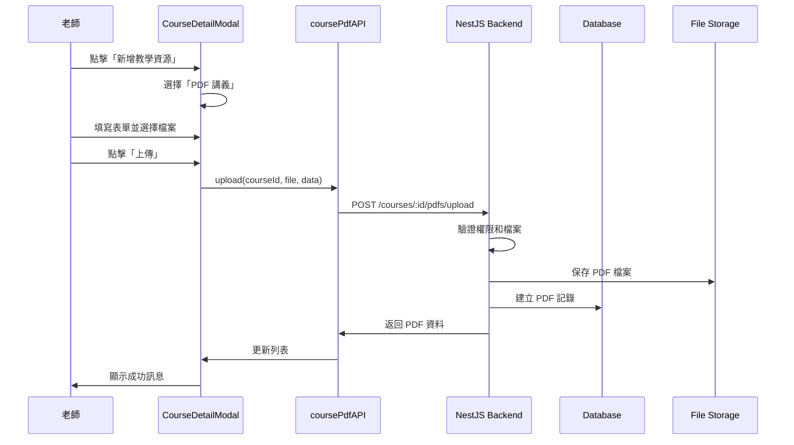

# 前端 PDF 講義功能使用指南

## 功能概述

已完整整合 PDF 講義上傳功能到課程管理介面中。老師可以在「查看課程內容」中直接上傳和管理 PDF 講義。

## 已實作的功能

### 1. API Service (✅ 完成)

新增 `frontend/src/services/course-pdf/course-pdf.api.ts`:
- `getAll()`: 取得課程的所有 PDF
- `upload()`: 上傳 PDF 檔案
- `getViewUrl()`: 取得檢視 URL
- `getDownloadUrl()`: 取得下載 URL
- `toggleDownload()`: 切換下載權限
- `update()`: 更新 PDF 資訊
- `delete()`: 刪除 PDF

已整合到 `frontend/src/services/course/course.api.ts` 和 `frontend/src/services/api.ts`

### 2. CourseDetailModal 整合 (✅ 完成)

修改 `frontend/src/components/CourseDetailModal.vue`:

#### 新增教學資源 Modal 改進
- 新增「資源類型」選擇器 (教學資源 / PDF 講義)
- PDF 上傳表單包含:
  - 標題 (必填)
  - 描述 (選填)
  - PDF 檔案選擇 (限制 20MB)
  - 可見性設定:
    - 所有報名學生可見
    - 特定學生群組可見 (多選)
  - 下載權限開關

#### 資源列表改進
- 合併顯示教學資源和 PDF 講義
- PDF 顯示特殊標籤:
  - 「PDF 講義」標籤 (紅色)
  - 「可下載」標籤 (綠色,如果允許下載)
  - 「所有學生可見」標籤 (藍色,如果所有學生可見)
- 顯示檔案大小
- 顯示描述

#### PDF 操作按鈕
- **檢視 PDF**: 在 modal 中開啟 PDF 檢視器
- **下載**: 如果允許下載,顯示下載按鈕
- **允許/禁止下載**: 老師可切換下載權限
- **刪除**: 刪除 PDF

### 3. PDF 檢視器元件 (✅ 完成)

新增 `frontend/src/components/PdfViewerModal.vue`:
- 全螢幕 modal 顯示 PDF
- 使用 iframe 嵌入 PDF
- 顯示標題、描述、檔案大小
- 如果允許下載,顯示下載按鈕
- 響應式設計,支援各種螢幕尺寸

## 使用流程

### 老師端操作流程

1. **進入課程管理**
   - 在課程列表頁面,點擊「查看課程內容」按鈕

2. **上傳 PDF 講義**
   - 點擊「新增教學資源」按鈕
   - 選擇「PDF 講義」類型
   - 填寫標題和描述
   - 選擇 PDF 檔案 (最大 20MB)
   - 設定可見性:
     - 勾選「所有報名學生可見」,或
     - 選擇特定學生群組 (可多選)
   - 選擇是否允許下載 (預設不允許)
   - 點擊「上傳」

3. **管理 PDF**
   - **檢視**: 點擊「檢視 PDF」在 modal 中預覽
   - **切換下載權限**: 點擊「允許下載」或「禁止下載」
   - **刪除**: 點擊「刪除」按鈕

### 學生端操作流程

1. **查看課程 PDF**
   - 在「我的課程」頁面進入課程詳情
   - 查看自己有權限的 PDF 列表

2. **檢視 PDF**
   - 點擊「檢視 PDF」在 modal 中閱讀
   - 如果老師允許下載,可點擊「下載 PDF」按鈕

## 技術實作細節

### 資料流程



### 權限控制

**可見性判斷**:
```typescript
// 所有學生可見
if (pdf.is_visible_to_all) {
  // 所有報名該課程的學生都可以看到
}

// 特定群組可見
if (!pdf.is_visible_to_all && pdf.student_group_ids.length > 0) {
  // 只有在指定群組中的學生可以看到
}
```

**下載權限**:
```typescript
if (pdf.allow_download) {
  // 顯示下載按鈕
} else {
  // 只能線上檢視
}
```

### 檔案驗證

前端驗證:
```typescript
// 檔案類型
if (file.type !== 'application/pdf') {
  alert('請選擇 PDF 檔案')
  return
}

// 檔案大小 (20MB)
if (file.size > 20 * 1024 * 1024) {
  alert('PDF 檔案大小不能超過 20MB')
  return
}
```

### API 呼叫範例

```typescript
// 上傳 PDF
await coursePdfAPI.upload(courseId, pdfFile, {
  title: '第一章講義',
  description: '數學第一章',
  is_visible_to_all: false,
  student_group_ids: [1, 2, 3],
  allow_download: false
})

// 切換下載權限
await coursePdfAPI.toggleDownload(courseId, pdfId, true)

// 刪除 PDF
await coursePdfAPI.delete(courseId, pdfId)
```

## 元件結構

```
CourseDetailModal.vue (主要元件)
├── 新增教學資源 Modal
│   ├── 資源類型選擇 (教學資源 / PDF)
│   ├── 教學資源表單 (原有)
│   └── PDF 上傳表單 (新增)
│       ├── 標題輸入
│       ├── 描述輸入
│       ├── 檔案選擇
│       ├── 可見性設定
│       └── 下載權限開關
├── 資源列表
│   ├── 教學資源卡片
│   └── PDF 卡片 (新增)
│       ├── 標題和標籤
│       ├── 檔案資訊
│       └── 操作按鈕
└── PdfViewerModal (PDF 檢視器)
    ├── PDF iframe 顯示
    ├── 下載按鈕 (如果允許)
    └── 關閉按鈕
```

## 樣式特點

### PDF 卡片樣式
- 紅色標籤標示「PDF 講義」
- 綠色標籤顯示「可下載」狀態
- 藍色標籤顯示「所有學生可見」
- 顯示檔案大小資訊

### 響應式設計
- 支援桌面和行動裝置
- Modal 自適應螢幕大小
- PDF 檢視器全螢幕顯示

## 測試建議

### 手動測試步驟

1. **上傳測試**:
   - 上傳小於 20MB 的 PDF ✓
   - 嘗試上傳非 PDF 檔案 (應拒絕) ✓
   - 嘗試上傳超過 20MB 的檔案 (應拒絕) ✓

2. **權限測試**:
   - 老師上傳到自己的課程 ✓
   - 設定「所有學生可見」✓
   - 設定「特定群組可見」✓

3. **檢視測試**:
   - 點擊「檢視 PDF」開啟 modal ✓
   - PDF 正確顯示在 iframe 中 ✓
   - 關閉 modal 正常運作 ✓

4. **下載測試**:
   - 預設不顯示下載按鈕 ✓
   - 切換「允許下載」後顯示下載按鈕 ✓
   - 點擊下載正常運作 ✓

5. **刪除測試**:
   - 刪除 PDF 需要確認 ✓
   - 刪除後列表更新 ✓

## 注意事項

1. **檔案大小**: 前端和後端都限制 20MB
2. **檔案類型**: 只接受 PDF 格式
3. **預設設定**: 
   - 預設不允許下載
   - 預設所有學生可見
4. **權限**: 只有老師和管理員可以上傳和管理 PDF
5. **刪除**: 刪除是軟刪除,檔案仍保留在伺服器

## 未來改進建議

1. **PDF.js 整合**: 使用 PDF.js 提供更好的 PDF 檢視體驗 (縮放、搜尋等)
2. **拖放上傳**: 支援拖放檔案上傳
3. **批次上傳**: 一次上傳多個 PDF
4. **預覽縮圖**: 顯示 PDF 第一頁的縮圖
5. **版本管理**: 支援 PDF 的版本更新
6. **下載統計**: 記錄學生下載次數

## 相關檔案

### 前端
- `frontend/src/services/course-pdf/course-pdf.api.ts` - PDF API service
- `frontend/src/services/course/course.api.ts` - 課程 API (含 PDF 方法)
- `frontend/src/components/CourseDetailModal.vue` - 課程詳情 modal (含 PDF 上傳)
- `frontend/src/components/PdfViewerModal.vue` - PDF 檢視器

### 後端
- `backend/src/cramschool/services/course-pdfs.service.ts` - PDF service
- `backend/src/cramschool/controllers/course-pdfs.controller.ts` - PDF controller
- `backend/prisma/schema.prisma` - 資料庫 schema

### Shared
- `shared/src/schemas/course-pdf.schema.ts` - PDF schema 定義

## 完成狀態

✅ API Service 實作完成
✅ CourseDetailModal 整合完成
✅ PdfViewerModal 元件完成
✅ 類型定義完成
✅ 權限控制完成
✅ 檔案驗證完成
✅ 響應式設計完成

所有功能已實作完成,可以開始使用!
