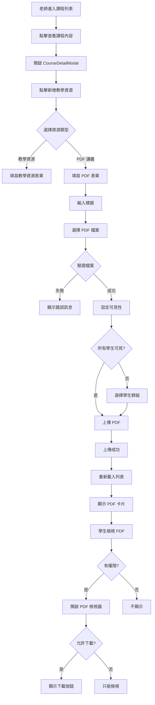

# PDF 講義功能完整實作總結

## 功能概述

已完整實作 PDF 講義上傳功能,老師可以在課程管理介面中上傳 PDF 檔案,設定可見的學生群組,並控制下載權限。學生可以在自己報名的課程中檢視有權限的 PDF 講義。

## 完整實作清單

### ✅ 後端實作 (Backend)

#### 1. 資料庫 Schema
- **檔案**: `backend/prisma/schema.prisma`
- **新增 Models**:
  - `CramschoolCoursePdf`: 儲存 PDF 基本資訊
  - `CramschoolCoursePdfStudentGroup`: PDF 與學生群組的多對多關聯
- **更新 Models**:
  - `CramschoolCourse`: 新增 `pdfs` 關聯
  - `CramschoolStudentGroup`: 新增 `coursePdfs` 關聯

#### 2. Shared Schema (TypeScript/Zod)
- **檔案**: `shared/src/schemas/course-pdf.schema.ts`
- **定義**:
  - `CoursePdfSchema`: 完整的 PDF 資料結構
  - `CreateCoursePdfDto`: 上傳時的 DTO
  - `UpdateCoursePdfDto`: 更新時的 DTO
- **Export**: 已在 `shared/src/schemas/index.ts` 中 export

#### 3. Service 層
- **檔案**: `backend/src/cramschool/services/course-pdfs.service.ts`
- **方法**:
  - `uploadPdf()`: 上傳 PDF 並驗證權限
  - `getPdfsForStudent()`: 學生取得可見的 PDF 列表
  - `getPdfsForTeacher()`: 老師取得課程所有 PDF
  - `viewPdf()`: 返回 PDF 檔案流供檢視
  - `downloadPdf()`: 返回 PDF 檔案流供下載 (需權限)
  - `deletePdf()`: 軟刪除 PDF
  - `toggleDownload()`: 切換下載權限
  - `updatePdf()`: 更新 PDF 資訊
  - `checkViewPermission()`: 檢查檢視權限

#### 4. Controller 層
- **檔案**: `backend/src/cramschool/controllers/course-pdfs.controller.ts`
- **API Endpoints**:
  - `POST /cramschool/courses/:courseId/pdfs/upload`: 上傳 PDF
  - `GET /cramschool/courses/:courseId/pdfs`: 取得 PDF 列表
  - `GET /cramschool/courses/:courseId/pdfs/:pdfId/view`: 檢視 PDF
  - `GET /cramschool/courses/:courseId/pdfs/:pdfId/download`: 下載 PDF
  - `PUT /cramschool/courses/:courseId/pdfs/:pdfId/download`: 切換下載權限
  - `PUT /cramschool/courses/:courseId/pdfs/:pdfId`: 更新 PDF 資訊
  - `DELETE /cramschool/courses/:courseId/pdfs/:pdfId`: 刪除 PDF
- **Swagger**: 完整的 API 文件註解

#### 5. Module 整合
- **檔案**: `backend/src/cramschool/cramschool.module.ts`
- 已註冊 `CoursePdfsController` 和 `CoursePdfsService`

#### 6. 單元測試
- **檔案**:
  - `backend/src/cramschool/services/course-pdfs.service.spec.ts` (15 測試)
  - `backend/src/cramschool/controllers/course-pdfs.controller.spec.ts` (14 測試)
- **狀態**: ✅ 所有測試通過

### ✅ 前端實作 (Frontend)

#### 1. API Service
- **檔案**: `frontend/src/services/course-pdf/course-pdf.api.ts`
- **方法**:
  - `getAll()`: 取得課程的所有 PDF
  - `upload()`: 上傳 PDF 檔案
  - `getViewUrl()`: 取得檢視 URL
  - `getDownloadUrl()`: 取得下載 URL
  - `toggleDownload()`: 切換下載權限
  - `update()`: 更新 PDF 資訊
  - `delete()`: 刪除 PDF
- **整合**: 已整合到 `course.api.ts` 和 `api.ts`

#### 2. CourseDetailModal 整合
- **檔案**: `frontend/src/components/CourseDetailModal.vue`
- **新增功能**:
  - 資源類型選擇器 (教學資源 / PDF 講義)
  - PDF 上傳表單 (標題、描述、檔案、可見性、下載權限)
  - 合併顯示教學資源和 PDF 列表
  - PDF 操作按鈕 (檢視、下載、切換權限、刪除)
  - 檔案驗證 (類型、大小)
  - 學生群組選擇器 (多選)

#### 3. PDF 檢視器元件
- **檔案**: `frontend/src/components/PdfViewerModal.vue`
- **功能**:
  - 全螢幕 modal 顯示
  - iframe 嵌入 PDF
  - 顯示標題、描述、檔案大小
  - 下載按鈕 (如果允許)
  - 響應式設計

## 核心功能特性

### 🎯 主要功能

1. **上傳 PDF**
   - 支援 PDF 格式檔案
   - 限制 20MB 大小
   - 自動保存到 `media/course_pdfs/{courseId}/` 目錄
   - 檔名使用時間戳避免衝突

2. **可見性控制**
   - **所有學生可見**: 所有報名該課程的學生都可以看到
   - **特定群組可見**: 只有在指定學生群組中的學生可以看到
   - 支援多個群組同時選擇

3. **下載權限控制**
   - 預設不允許下載 (只能線上檢視)
   - 老師可隨時切換下載權限
   - 學生端根據權限顯示/隱藏下載按鈕

4. **權限管理**
   - 老師只能上傳到自己的課程
   - 學生只能看到自己有權限的 PDF
   - 管理員可以管理所有課程的 PDF

5. **檔案管理**
   - 軟刪除機制 (is_active = false)
   - 檔案保留在伺服器上
   - 可更新標題、描述、群組設定

### 🔒 安全性

1. **檔案驗證**
   - 前端: 檔案類型和大小驗證
   - 後端: MIME type 驗證
   - 路徑遍歷防護

2. **權限驗證**
   - 每次請求都驗證使用者身份
   - 檢查課程擁有權
   - 檢查學生報名狀態
   - 檢查群組成員資格

3. **資料保護**
   - 軟刪除保護資料
   - 檔案流傳輸避免直接暴露路徑
   - JWT 認證保護所有 API

## 使用流程圖



## API 文件

### 上傳 PDF
```http
POST /api/cramschool/courses/:courseId/pdfs/upload
Content-Type: multipart/form-data

Body:
- file: PDF 檔案
- title: 標題
- description: 描述 (可選)
- is_visible_to_all: true/false
- student_group_ids: [1, 2, 3]
- allow_download: true/false

Response:
{
  "pdf_id": 1,
  "title": "第一章講義",
  "file_path": "course_pdfs/1/1234567890_lecture.pdf",
  "file_size": 1024000,
  "course_id": 1,
  "allow_download": false,
  "is_visible_to_all": true,
  ...
}
```

### 取得 PDF 列表
```http
GET /api/cramschool/courses/:courseId/pdfs

Response:
[
  {
    "pdf_id": 1,
    "title": "第一章講義",
    "description": "數學第一章",
    "file_size": 1024000,
    "allow_download": false,
    "is_visible_to_all": true,
    "student_group_ids": [1, 2],
    ...
  }
]
```

### 檢視 PDF
```http
GET /api/cramschool/courses/:courseId/pdfs/:pdfId/view

Response: PDF 檔案流 (Content-Type: application/pdf, Content-Disposition: inline)
```

### 下載 PDF
```http
GET /api/cramschool/courses/:courseId/pdfs/:pdfId/download

Response: PDF 檔案流 (Content-Type: application/pdf, Content-Disposition: attachment)
```

### 切換下載權限
```http
PUT /api/cramschool/courses/:courseId/pdfs/:pdfId/download

Body:
{
  "allow_download": true
}

Response: 更新後的 PDF 資料
```

### 刪除 PDF
```http
DELETE /api/cramschool/courses/:courseId/pdfs/:pdfId

Response:
{
  "message": "PDF 已成功刪除"
}
```

## 部署檢查清單

### 後端部署

- [ ] 執行 Prisma migration:
  ```bash
  cd backend
  npx prisma migrate dev --name add_course_pdf
  ```

- [ ] 建立 media 目錄:
  ```bash
  mkdir -p backend/media/course_pdfs
  ```

- [ ] 設定環境變數 (`.env`):
  ```env
  MEDIA_ROOT=./media
  MEDIA_URL=/media/
  ```

- [ ] 重新啟動後端服務:
  ```bash
  cd backend
  npm run start:dev
  ```

### 前端部署

- [ ] 安裝依賴 (如果需要):
  ```bash
  cd frontend
  npm install
  ```

- [ ] 編譯前端:
  ```bash
  cd frontend
  npm run build
  ```

- [ ] 啟動開發伺服器:
  ```bash
  cd frontend
  npm run dev
  ```

### 測試檢查

- [ ] 後端測試通過:
  ```bash
  cd backend
  npm test -- course-pdfs
  ```

- [ ] API 可以正常呼叫 (使用 Swagger UI):
  ```
  http://localhost:3000/api/docs
  ```

- [ ] 前端介面正常顯示

## 使用說明

### 老師操作步驟

1. 登入系統 (老師帳號)
2. 進入「課程管理」頁面
3. 點擊任一課程的「查看課程內容」按鈕
4. 在彈出的 modal 中,點擊「新增教學資源」
5. 選擇「PDF 講義」類型
6. 填寫表單:
   - 輸入標題 (必填)
   - 輸入描述 (選填)
   - 選擇 PDF 檔案
   - 設定可見性 (所有學生 / 特定群組)
   - 選擇是否允許下載
7. 點擊「上傳」按鈕
8. 上傳成功後,PDF 會出現在資源列表中

### 學生操作步驟

1. 登入系統 (學生帳號)
2. 進入「我的課程」頁面
3. 點擊已報名課程的「查看課程內容」
4. 查看自己有權限的 PDF 列表
5. 點擊「檢視 PDF」在 modal 中閱讀
6. 如果老師允許,可點擊「下載 PDF」按鈕

## 權限矩陣

| 操作 | 管理員 | 老師 | 學生 |
|------|--------|------|------|
| 上傳 PDF | ✅ | ✅ (自己的課程) | ❌ |
| 查看所有 PDF | ✅ | ✅ (自己的課程) | ❌ |
| 查看有權限的 PDF | ✅ | ✅ | ✅ |
| 檢視 PDF | ✅ | ✅ | ✅ (有權限) |
| 下載 PDF | ✅ | ✅ | ✅ (需允許) |
| 切換下載權限 | ✅ | ✅ (自己的課程) | ❌ |
| 更新 PDF 資訊 | ✅ | ✅ (自己的課程) | ❌ |
| 刪除 PDF | ✅ | ✅ (自己的課程) | ❌ |

## 檔案結構

```
9Jang/
├── backend/
│   ├── prisma/
│   │   └── schema.prisma (新增 PDF models)
│   ├── src/
│   │   └── cramschool/
│   │       ├── controllers/
│   │       │   ├── course-pdfs.controller.ts (新增)
│   │       │   └── course-pdfs.controller.spec.ts (新增)
│   │       ├── services/
│   │       │   ├── course-pdfs.service.ts (新增)
│   │       │   └── course-pdfs.service.spec.ts (新增)
│   │       └── cramschool.module.ts (更新)
│   └── media/
│       └── course_pdfs/ (新增,存放 PDF 檔案)
├── shared/
│   └── src/
│       └── schemas/
│           ├── course-pdf.schema.ts (新增)
│           └── index.ts (更新)
└── frontend/
    └── src/
        ├── services/
        │   ├── course-pdf/
        │   │   └── course-pdf.api.ts (新增)
        │   ├── course/
        │   │   └── course.api.ts (更新)
        │   └── api.ts (更新)
        └── components/
            ├── CourseDetailModal.vue (更新)
            └── PdfViewerModal.vue (新增)
```

## 技術特點

### 後端技術
- **框架**: NestJS + Prisma
- **檔案處理**: Multer + fs/promises
- **驗證**: Zod schemas
- **認證**: JWT + Guards
- **測試**: Jest (29 個測試,全部通過)

### 前端技術
- **框架**: Vue 3 + TypeScript
- **API**: Axios
- **UI**: Tailwind CSS
- **檔案上傳**: FormData + multipart/form-data
- **PDF 顯示**: iframe 嵌入

## 資料庫 Schema

```prisma
model CramschoolCoursePdf {
  pdfId           Int       @id @default(autoincrement())
  title           String
  description     String?
  filePath        String
  fileSize        Int
  courseId        Int
  uploadedById    Int
  allowDownload   Boolean   @default(false)
  isVisibleToAll  Boolean   @default(false)
  isActive        Boolean   @default(true)
  createdAt       DateTime  @default(now())
  updatedAt       DateTime  @updatedAt

  course          CramschoolCourse @relation(...)
  studentGroups   CramschoolCoursePdfStudentGroup[]

  @@index([courseId])
  @@index([uploadedById])
  @@index([isActive])
}

model CramschoolCoursePdfStudentGroup {
  id          Int @id @default(autoincrement())
  pdfId       Int
  groupId     Int

  pdf         CramschoolCoursePdf @relation(...)
  group       CramschoolStudentGroup @relation(...)

  @@unique([pdfId, groupId])
}
```

## 測試結果

### 後端測試
```
✓ CoursePdfsService (15 tests)
  ✓ uploadPdf - 成功上傳 PDF (老師)
  ✓ uploadPdf - 拒絕非老師上傳
  ✓ uploadPdf - 拒絕上傳到不屬於自己的課程
  ✓ uploadPdf - 拒絕上傳到不存在的課程
  ✓ getPdfsForStudent - 返回學生可見的 PDF 列表
  ✓ getPdfsForStudent - 拒絕未報名課程的學生
  ✓ getPdfsForStudent - 拒絕找不到學生資料
  ✓ getPdfsForTeacher - 返回老師課程的所有 PDF
  ✓ getPdfsForTeacher - 拒絕查看不屬於自己課程的 PDF
  ✓ getPdfsForTeacher - 管理員可以查看所有課程的 PDF
  ✓ toggleDownload - 成功切換下載權限
  ✓ toggleDownload - 拒絕非老師切換下載權限
  ✓ deletePdf - 成功刪除 PDF (軟刪除)
  ✓ deletePdf - 拒絕非老師刪除 PDF
  ✓ deletePdf - 管理員可以刪除任何 PDF

✓ CoursePdfsController (14 tests)
  ✓ uploadPdf - 成功上傳 PDF
  ✓ uploadPdf - 拒絕沒有檔案的請求
  ✓ uploadPdf - 拒絕非 PDF 檔案
  ✓ uploadPdf - 拒絕超過大小限制的檔案
  ✓ uploadPdf - 拒絕沒有標題的請求
  ✓ getPdfs - 返回學生的 PDF 列表
  ✓ getPdfs - 返回老師的 PDF 列表
  ✓ getPdfs - 返回管理員的 PDF 列表
  ✓ viewPdf - 返回 PDF 檔案流供檢視
  ✓ downloadPdf - 返回 PDF 檔案流供下載
  ✓ toggleDownload - 成功切換下載權限
  ✓ toggleDownload - 拒絕沒有 allow_download 參數的請求
  ✓ updatePdf - 成功更新 PDF 資訊
  ✓ deletePdf - 成功刪除 PDF

Total: 29 tests passed ✅
```

## 相關文件

- `PDF_FEATURE_README.md`: 後端功能說明和 API 文件
- `FRONTEND_PDF_GUIDE.md`: 前端使用指南
- `PDF_FEATURE_COMPLETE.md`: 完整實作總結 (本文件)

## 下一步

功能已完全實作完成!你可以:

1. **執行 Migration** 來建立資料表
2. **啟動服務** 開始使用
3. **測試功能** 確保一切正常運作
4. **根據需求調整** UI 樣式或功能細節

如有任何問題或需要調整,隨時告訴我!
