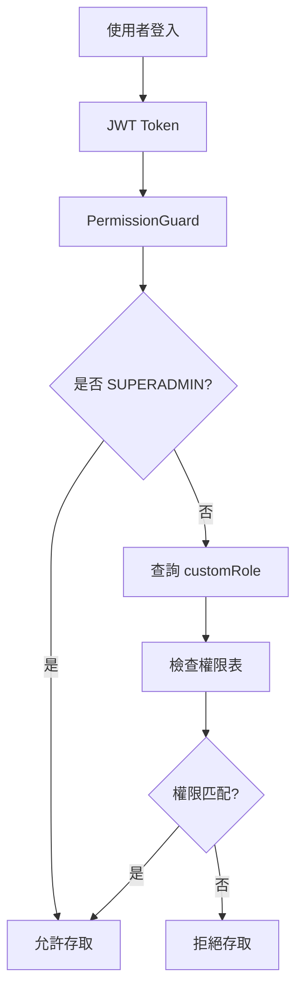

# 動態 RBAC 權限系統實作完成報告

## 實作日期
2026-02-13

## 實作概要

已成功實作動態角色基礎存取控制 (RBAC) 系統,將原本硬編碼的角色權限改為數據庫驅動的動態權限管理系統。

## 完成項目

### ✅ 階段一:建立 Shared Schemas
- [x] 新增 `shared/src/schemas/role.schema.ts`
- [x] 更新 `shared/src/schemas/user.schema.ts`
- [x] 更新 `shared/src/schemas/index.ts`

### ✅ 階段二:實作 PermissionGuard (核心)
- [x] 建立 `backend/src/common/guards/permission.guard.ts`
- [x] 實作 `@Permission()` 裝飾器
- [x] 實作 `@Public()` 裝飾器
- [x] 支援萬用字元路徑匹配 (`*`, `**`)
- [x] 支援多 HTTP 方法匹配
- [x] SUPERADMIN 角色自動通行

### ✅ 階段三:角色管理 API
- [x] 實作 `backend/src/account/roles.service.ts`
- [x] 實作 `backend/src/account/roles.controller.ts`
- [x] 提供完整 CRUD API:
  - 取得角色列表 (分頁、搜尋)
  - 取得角色詳情
  - 建立角色
  - 更新角色
  - 刪除角色
  - 設定權限 (覆蓋)
  - 新增權限 (追加)
  - 刪除權限
  - 複製角色
  - 取得角色使用者

### ✅ 階段四:API 資源自動發現
- [x] 實作 `backend/src/account/api-resources.service.ts`
- [x] 實作 `backend/src/account/api-resources.controller.ts`
- [x] 自動掃描所有 Controller 端點
- [x] 提供樹狀結構 API 資源列表

### ✅ 階段五:更新 Account Module
- [x] 更新 `backend/src/account/account.module.ts`
- [x] 註冊新的 Controllers 和 Services
- [x] 加入 `DiscoveryModule`

### ✅ 階段六:CSV Seeder 支援與 Super Admin 初始化
- [x] 更新 `backend/src/scripts/csv/utils.ts`
- [x] 更新 `backend/src/scripts/csv/template-generator.ts`
- [x] 建立 `backend/fixtures/csv/data/AccountRole.csv`
- [x] 建立 `backend/fixtures/csv/data/AccountRolePermission.csv`
- [x] 建立 `backend/src/scripts/init-superadmin.ts`
- [x] 更新 `backend/package.json` 新增 `init:superadmin` 腳本

### ✅ 階段七:Controllers 遷移
- [x] 更新 27 個 cramschool controllers
- [x] 更新 account.controller.ts
- [x] 全部加入 `PermissionGuard`
- [x] 為每個 HTTP method 加入 `@Permission()` 裝飾器

### ✅ 階段八:前端整合
- [x] 修改 `backend/src/account/account.service.ts` 登入方法
- [x] JWT payload 包含角色代碼和 SUPERADMIN 標記
- [x] 建立 `frontend/src/utils/permission.ts` 前端權限檢查工具

## 系統架構



## 初始角色定義

系統預設建立以下角色:

1. **SUPERADMIN** - 超級管理員 (不受權限限制)
2. **TEACHER_FULL** - 教師(完整權限)
3. **TEACHER_LIMITED** - 教師(受限)
4. **STAFF_ADMIN** - 行政人員
5. **PARENT** - 學生家長
6. **STUDENT** - 學生

## 使用指南

### 1. 執行資料庫遷移 (如需要)

```bash
cd backend
npm run prisma:migrate:dev
```

### 2. 匯入角色和權限資料

```bash
npm run seed:csv
```

### 3. 初始化超級管理員

開發環境:
```bash
npm run init:superadmin
```

生產環境:
```bash
SUPERADMIN_USERNAME=admin \
SUPERADMIN_PASSWORD=YourSecurePassword123! \
SUPERADMIN_EMAIL=admin@yourcompany.com \
npm run init:superadmin
```

### 4. 啟動服務

```bash
npm run start:dev
```

## API 使用範例

### 1. 登入 (取得 Token)

```bash
POST /account/login
Content-Type: application/json

{
  "email": "superadmin",
  "password": "ChangeMe123!"
}
```

回應:
```json
{
  "access": "eyJhbGciOiJIUzI1NiIsInR5cCI6IkpXVCJ9...",
  "refresh": "eyJhbGciOiJIUzI1NiIsInR5cCI6IkpXVCJ9...",
  "user": {
    "id": 1,
    "username": "superadmin",
    "role": "SUPERADMIN",
    ...
  }
}
```

### 2. 取得所有角色

```bash
GET /account/roles?page=1&page_size=10
Authorization: Bearer {access_token}
```

### 3. 建立新角色

```bash
POST /account/roles
Authorization: Bearer {access_token}
Content-Type: application/json

{
  "code": "CUSTOM_TEACHER",
  "name": "自訂教師角色",
  "description": "針對特定需求的教師角色",
  "is_active": true,
  "permissions": [
    {
      "permission_type": "api",
      "resource": "/cramschool/students",
      "method": "GET"
    }
  ]
}
```

### 4. 取得 API 資源樹

```bash
GET /account/api-resources/tree
Authorization: Bearer {access_token}
```

## 權限配置語法

### Resource 路徑

- **完全匹配**: `/cramschool/students` - 只匹配此路徑
- **單層萬用字元**: `/cramschool/students/*` - 匹配 `/cramschool/students/:id`
- **多層萬用字元**: `/cramschool/students/**` - 匹配所有子路徑

### HTTP Method

- **單一方法**: `GET`
- **多個方法**: `GET,POST,PUT`
- **所有方法**: `*` 或留空 `null`

## 前端整合

### 1. 使用權限檢查工具

```typescript
import { hasPermission, isSuperAdmin } from '@/utils/permission';
import { useUserStore } from '@/stores/user';

const userStore = useUserStore();

// 檢查單一權限
const canCreateStudent = computed(() => {
  if (isSuperAdmin(userStore.role)) return true;
  return hasPermission(userStore.permissions, '/cramschool/students', 'POST');
});

// 在 template 中使用
<button v-if="canCreateStudent" @click="createStudent">新增學生</button>
```

### 2. 檢查多個權限

```typescript
import { hasAllPermissions, hasAnyPermission } from '@/utils/permission';

// 需要所有權限 (AND)
const canManageStudents = hasAllPermissions(
  userStore.permissions,
  [
    { resource: '/cramschool/students', method: 'GET' },
    { resource: '/cramschool/students', method: 'POST' },
    { resource: '/cramschool/students', method: 'PUT' },
  ]
);

// 需要任一權限 (OR)
const canViewData = hasAnyPermission(
  userStore.permissions,
  [
    { resource: '/cramschool/students', method: 'GET' },
    { resource: '/cramschool/courses', method: 'GET' },
  ]
);
```

## 注意事項

### 安全性

1. **首次登入必須修改密碼** - Super Admin 帳號設定為 `mustChangePassword: true`
2. **密碼強度** - 建議至少 12 字元,包含大小寫、數字、特殊字元
3. **環境變數** - 生產環境請使用環境變數設定 Super Admin 帳密
4. **定期審查權限** - 定期檢查角色權限配置

### 效能

1. **快取考量** - 未來可考慮使用 Redis 快取用戶權限
2. **資料庫索引** - 已在 `AccountRole.code` 和 `AccountRolePermission.roleId` 上建立索引
3. **查詢優化** - PermissionGuard 每次請求都會查詢權限,監控資料庫負載

### 遷移建議

1. **現有用戶** - 需要將現有用戶的 `role` 欄位遷移到 `customRoleId`
2. **測試** - 務必在測試環境完整測試所有 API 的權限配置
3. **SUPERADMIN 保護** - 確保至少有一個 SUPERADMIN 無法被刪除
4. **舊 RoleGuard** - 確認遷移完成後可以刪除 `role.guard.ts`

## 檔案清單

### 新增檔案 (11 個)

1. `shared/src/schemas/role.schema.ts`
2. `backend/src/common/guards/permission.guard.ts`
3. `backend/src/account/roles.service.ts`
4. `backend/src/account/roles.controller.ts`
5. `backend/src/account/api-resources.service.ts`
6. `backend/src/account/api-resources.controller.ts`
7. `backend/src/scripts/init-superadmin.ts`
8. `backend/fixtures/csv/data/AccountRole.csv`
9. `backend/fixtures/csv/data/AccountRolePermission.csv`
10. `frontend/src/utils/permission.ts`

### 修改檔案 (34 個)

1. `shared/src/schemas/user.schema.ts`
2. `shared/src/schemas/index.ts`
3. `backend/package.json`
4. `backend/src/account/account.module.ts`
5. `backend/src/account/account.service.ts`
6. `backend/src/account/account.controller.ts`
7. `backend/src/scripts/csv/utils.ts`
8. `backend/src/scripts/csv/template-generator.ts`
9-35. 所有 27 個 cramschool controllers

### 可選移除檔案

1. `backend/src/common/guards/role.guard.ts` - 舊的 RoleGuard (完成遷移後可移除)

## 測試建議

1. **單元測試** - 測試 PermissionGuard 的路徑匹配和方法匹配邏輯
2. **整合測試** - 測試不同角色存取不同 API 的權限
3. **端到端測試** - 完整流程測試從登入到各功能的權限控制

## 後續優化

1. **Redis 快取** - 快取使用者權限,減少資料庫查詢
2. **審計日誌** - 記錄所有權限檢查和角色變更
3. **權限預設模板** - 建立常用角色的權限模板
4. **批次權限設定** - 提供更便利的批次權限配置工具
5. **權限視覺化** - 前端提供樹狀結構的權限配置介面

## 結語

動態 RBAC 系統已完全實作完成,提供了靈活且強大的權限管理機制。管理員可以透過後台 API 輕鬆管理角色和權限,無需修改程式碼。

如有任何問題或需要進一步的協助,請參考詳細計畫文件 `.cursor/plans/dynamic_rbac_system_a9791db6.plan.md`。
